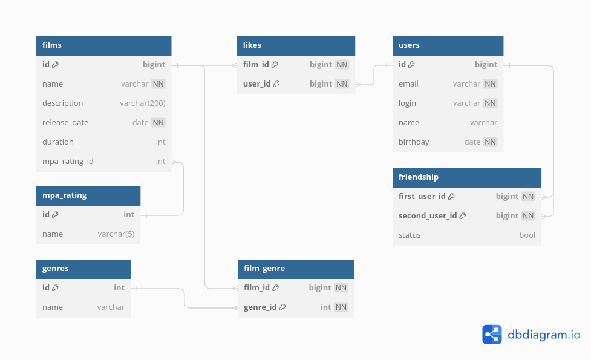

# Filmorate
Приложение для подбора фильма по рекомендациям

## Описание
Бэкенд сервиса, который работает с фильмами и оценками пользователей, а также возвращает топ-5 фильмов, рекомендованных к просмотру.

Стэк: Java, Spring Boot, SQL, JDBC, JUnit5

Функциональность: 
- CRUD операции для пользователей, фильмов, рейтингов и жанров;
- добавление пользователей в друзья;
- добавление и удаление лайков фильмам;
- вывод популярных фильмов по количеству лайков; 

## Схема базы данных


## Инструкция
Требования: 
- Java 11
- Maven 

Установка:
```bash
git clone https://github.com/ilia-kmrv/java-filmorate.git
``` 
